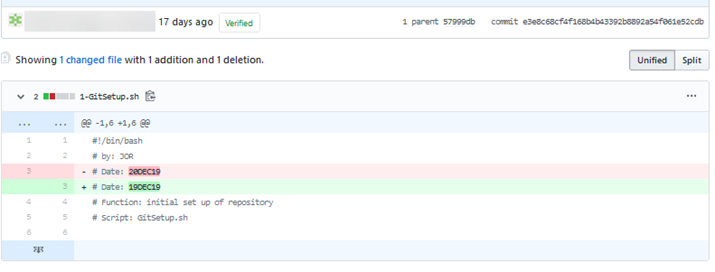

# GITHUB

In my practical notes, I introduce GIT and show adds and commits. I also show how to initialize a folder to use GIT and showed the creation of a hidden .git folder for the metadata. The next step is to be able to push the contents of the git folder to a public git repository. For most of us, this will be GITHUB. This is what facilitates team working, collaboration, and the ability to track user’s contributions.&#x20;

Differentiating between git and GitHub; GIT is a local version control system which gives the developer snapshots of each committed version. GitHub is a repository in the cloud which allows the central storage of the local repositories. But it is just another clone, neither the local machine or GitHub are in any way a single primary source of the files.&#x20;

When you are off-line you can work entirely on your local repository. When you reconnect to the Internet you push the changes to GitHub.&#x20;

If you’re working with a new machine, you can clone an entire repository from GitHub to the new machine. One of the biggest advantages of GitHub is the ability to work collaboratively. Apart from user management there are also a wide range of tools to facilitate collaborative projects. Creating a GitHub account is reasonably straightforward and is covered in the practical notes.&#x20;

For serious use, almost everyone will use SSH keys, and this is covered in later exercises.

The underlying database of GitHub is based on cryptographic hashes, the long string of text in the top-right of the window.

<figure><figcaption></figcaption></figure>

Once you have created your account and you can begin to look around, you realize there is a very rich environment. Tens of thousands of developers keep repositories here and make the contents publicly available. You can search for a topic in a particular programming language and find people are working on that. You can click to watch the project see can see any activity that occurs. There is a tab for issues where bugs can be identified and tracked. There’s a wiki associated with each project. And there are other tools that can be examined later. There is also marketplace with commercial tools which you can add to project.&#x20;

For DevOPs, it can be all integrated!
